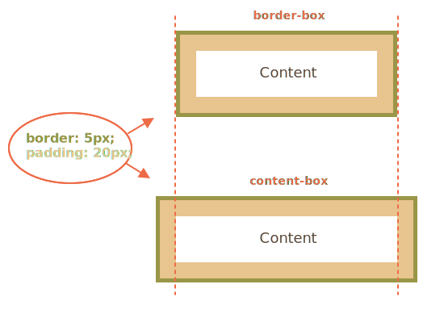

# Свойство box-sizing

Свойство `box-sizing` может принимать одно из двух значений -- `border-box` или `content-box`. В зависимости от выбранного значения браузер по-разному трактует значение свойств `width/height`.

## Значения box-sizing

`content-box`
: Это значение по умолчанию. В этом случае свойства `width/height` обозначают то, что находится *внутри `padding`*.

`border-box`
: Значения `width/height` задают высоту/ширину *всего элемента*.

Для большей наглядности посмотрим на картинку этого `div` в зависимости от `box-sizing`:

```css
/*+ no-beautify */
div {
  width: 200px;
  height: 100px;
*!*
  box-sizing: border-box (вверху) | content-box (внизу);
*/!*

  padding: 20px;
  border:5px solid brown;
}
```



В верхнем случае браузер нарисовал весь элемент размером в `width x height`, в нижнем -- интерпретировал `width/height` как размеры внутренней области.

Исторически сложилось так, что по умолчанию принят `content-box`, а `border-box` некоторые браузеры используют если не указан `DOCTYPE`, в режиме совместимости.

Но есть как минимум один случай, когда явное указание `border-box` может быть полезно: растягивание элемента до ширины родителя.

## Пример: подстроить ширину к родителю

Задача: подогнать элемент по ширине внешнего элемента, чтобы он заполнял всё его пространство. Без привязки к конкретному размеру элемента в пикселях.

Например, мы хотим, чтобы элементы формы ниже были одинакового размера:

```html autorun
<style>
  form {
    width: 200px;
    border: 2px solid green;
  }

  form input,
  form select {
    display: block;
    padding-left: 5px;
    /* padding для красоты */
  }
</style>

<form>
*!*
  <input>
  <input>
  <select>
    <option>опции</option>
  </select>
*/!*
</form>
```

Как сделать, чтобы элементы растянулись чётко по ширине `FORM`? Попробуйте добиться этого самостоятельно, перед тем как читать дальше.

### Попытка width:100%

Первое, что приходит в голову -- поставить всем элементам `INPUT` ширину `width: 100%`.

Попробуем:

```html autorun height=100 no-beautify
<style>
  form {
    width: 200px;
    border: 2px solid green;
  }

  form input, form select {
    display: block;
    padding-left: 5px;
*!*
    width: 100%;
*/!*
  }
</style>

<form>
  <input>
  <input>
  <select><option>опции</option></select>
</form>
```

Как видно, не получается. **Элементы вылезают за пределы родителя.**

**Причина -- ширина элемента 100% по умолчанию относится к внутренней области, не включающей `padding` и `border`.** То есть, внутренняя область растягивается до `100%` родителя, и к ней снаружи прибавляются `padding/border`, которые и вылезают.

Есть два решения этой проблемы.

### Решение: дополнительный элемент

Можно убрать `padding/border` у элементов `INPUT/SELECT` и завернуть каждый из них в дополнительный `DIV`, который будет обеспечивать дизайн:

```html autorun height=100
<style>
  form {
    width: 200px;
    border: 2px solid green;
  }
  /* убрать padding/border */

  form input,
  form select {
    padding: 0;
    border: 0;
    width: 100%;
  }
  /* внешний div даст дизайн */

  form div {
    padding-left: 5px;
    border: 1px solid black;
  }
</style>

<form>
  <div>
    <input>
  </div>
  <div>
    <input>
  </div>
  <div>
    <select>
      <option>опции</option>
    </select>
  </div>
</form>
```

В принципе, это работает. Но нужны дополнительные элементы. А если мы делаем дерево или большую редактируемую таблицу, да и вообще -- любой интерфейс, где элементов и так много, то лишние нам точно не нужны.

Кроме того, такое решение заставляет пожертвовать встроенным в браузер дизайном элементов `INPUT/SELECT`.

### Решение: box-sizing

Существует другой способ, гораздо более естественный, чем предыдущий.

**При помощи `box-sizing: border-box` мы можем сказать браузеру, что ширина, которую мы ставим, относится к элементу полностью, включая `border` и `padding`**:

```html autorun height=100 no-beautify
<style>
  form {
    width: 200px;
    border: 2px solid green;
  }

  form input, form select {
    display: block;
    padding-left: 5px;
*!*
    -moz-box-sizing: border-box; /* в Firefox нужен префикс */
    box-sizing: border-box;
    width: 100%;
*/!*
  }
</style>

<form>
  <input>
  <input>
  <select><option>опции</option></select>
</form>
```

Мы сохранили "родную" рамку вокруг `INPUT/SELECT` и не добавили лишних элементов. Всё замечательно.

Свойство `box-sizing` поддерживается в IE начиная с версии 8.